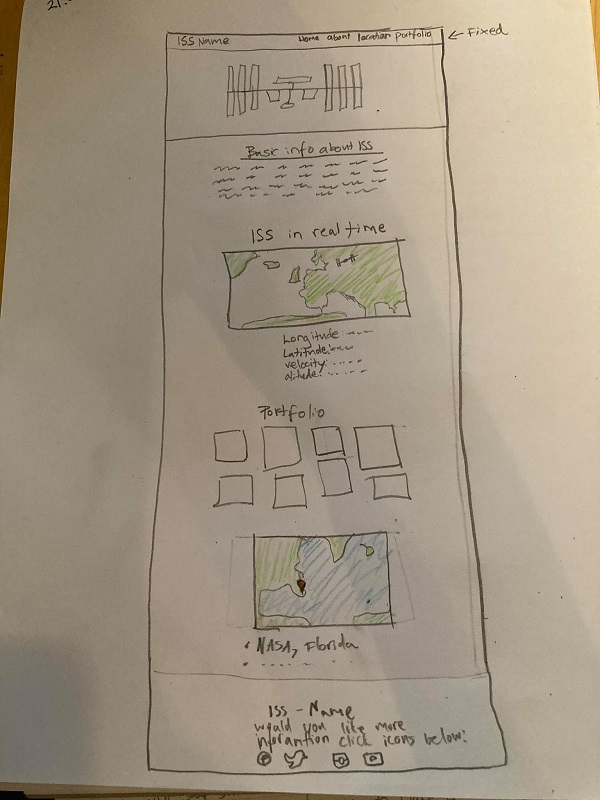
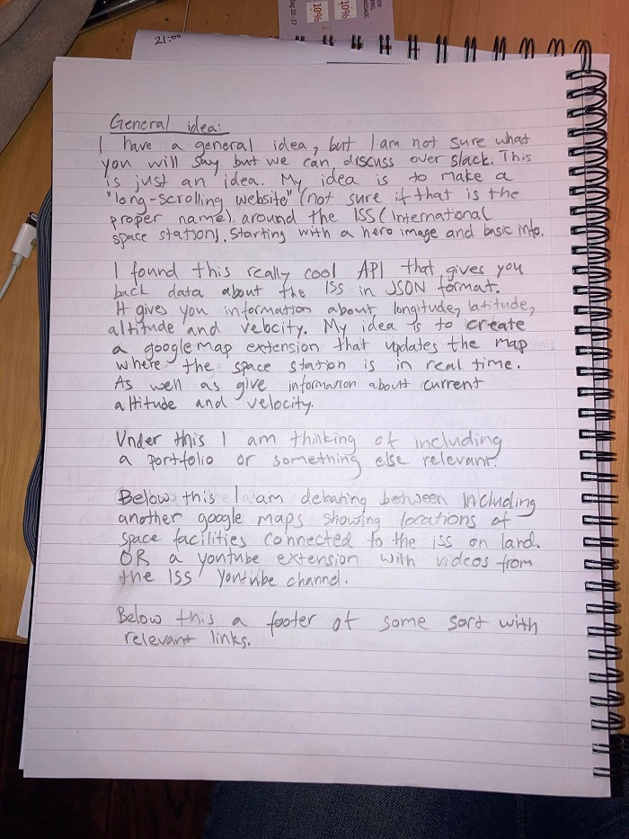

# The ISS in Real Time

For my second project I decided to make a website based around the International Space Station or ISS for short. While we are stepping into a new age in space exploration through companies like SpaceX and Virgin Galactic, the ISS has made it possible for people to have an ongoing presence in space. The ISS has been, and continues to be, a driving force in all kinds of scientific research- as well as international collaboration.

NASA currently is working on a plan to explore other worlds. The space station is one of the first steps. NASA will use lessons learned on the space station to prepare for human missions that reach farther into space than ever before. This is all to say that the ISS time is not over, quite on the contrary: it has just begun. With this in mind, let’s explore what the ISS is all about.

## UX

When making this website, considering time and skill constraints I wanted to make a website that was very user friendly, with this in mind I decided to make the website a One-page website to allow the user to just scroll through the content. I wanted to be able to show a couple of different aspects of the ISS and I decided that this would work the best if I used a couple of different elements on the page.
The website is intended for a user who has little to no knowledge about the ISS and is looking for an introduction to the subject, the page aims to provide the user with an basic understanding of a couple different aspects of the ISS: basic information, pictures, real time location and thoughts from some astronauts who have visited the ISS. There is only one big chunk of text and that is in the “About section”, which gives a brief explanation of what the ISS is and what the goal of the projects is. This text is written in plain english to make it understandable for a large audience.

**User Stories**

- As an elementary school teacher, I want to give my students a basic understanding of what the ISS is, what I need is a website with some basic information but mostly engaging content that keeps my students interested.

- As a person who has never really been interested in space, who now wants to be up to speed now that space exploration is on the tip of everyone's tongue. People keep bringing up the ISS but I don’t know anything about it. The ISS section on NASA's official website is too cluttered, I need something simple and easy to understand.

- As as amature astronomer who likes to aim my telescope towards the night sky, I like observing the ISS and would like to know when it crosses over my general area so I can observe it through my telescope while it passes by.

In the beginning of the project I had a pretty clear idea of the structure of the page, as well as what elements I thought would look good and convey what I wanted to convey. I ended up following my original plan pretty closely with a couple of exceptions mainly regarding placement but also deciding on a astronaut quote carousel instead of an embedded Youtube video.

## Features

- Navigation bar
  - At the very top of the page is a navigation bar that allows you to maneuver around the page in between the Home, About, Location R-T, Gallery and Astronaut page section. The navigation bar is fixed to the top of the page.

* Top section/Home
  - At the top of the page there is a header element and an image of one of the ISS logos.
* About section

  - This section contains a png drawing of the ISS and an information section with general information about the ISS.

* RT section

  - This section contains two main elements: the first element is a Leaflet map that provides a live update of where the ISS is on a map, the second element provides the coordinates, altitude and velocity of the ISS in textform in real time.

* Gallery section

  - This section has a photo gallery containing 9 pictures taken of/on/around the ISS. The gallery uses the jQuery plugin Magnific Popup to make the image light up when the mouse hovers over the image. All the images grow into full size when clicked and can be rotated through.

* Quotes/Astronaut section

  - This section contains a rotating carousel element, the section is centered around four astronauts who have all visited the ISS. In the rotating element there is an image of the astronaut, their name as well as quote from the astronaut in question. The carousel effect is generated by the jQuery plugin Owl Carousel and rotation is automatic.

* Footer section
  - The footer section contains a small version of the same ISS logo image as on the top of the page. When clicked this element takes you back to the top of the page. Below the ISS logo there are four Font Awesome icons in the form of the Facebook, Instagram, Youtube and Twitter logo which all take you to their respective ISS page.

## Features Left to Implement

- Responsive web design

  - Responsive web design is so incredibly crucial when creating a website today since most people browsing the internet use their phones or tablets. This website is not responsive, the reason being a lack of time. My first order of business in future work on this website is to implement a responsive web design.

## Technologies Used

- [jQuery](https://jquery.com/)

  - The project uses JQuery to simplify DOM manipulation.

- [Bootstrap](https://getbootstrap.com/)

  - The project uses Bootstrap to provide a grid system, as well as basic layout and styling.

- [Font Awesome](https://fontawesome.com/)

  - The project uses Font Awesome to add icons.

- [Magnific Popup](https://dimsemenov.com/plugins/magnific-popup/)

  - The project uses Magnific Popup to provide "Lightbox gallery" to Gallery section of page.

- [Owl Carousel](https://owlcarousel2.github.io/OwlCarousel2/)

  - The project uses Owl Carousel to create a rotating carousel element to Quotes section of page.

- [Leaflet](https://leafletjs.com/)
  - The project uses the Leaflet Javascript library to display map with real time ISS icon to ISS Real Time section of page.

## Testing

**Testing Navbar smooth scroll:**

1. Go to Home page
1. Hover mouse over all navbar anchor links
1. Home, About, ISS Real Time, Gallery and Quotes section all light up red when hovered over
1. Click Home, About, ISS Real Time, Gallery and Quotes section
1. All navbar links takes me to intended place on page, while smooth scrolling
1. Test successful

**Testing ISS Real Time Map:**

1. Go to ISS Real Time section of page
1. Hover mouse over Leaflet map
1. Mouse transitions into cursor when hovering over map
1. Use zoom-in function in left corner of map
1. Use zoom-out function in left corner of map
1. Zoom-in and zoom-out successful
1. Use touchpad on computer to zoom-in
1. Use touchpad on computer to zoom-out
1. Zoom-in and zoom-out successful
1. Use touchpad to move around map
1. Maneuvering map successful
1. Test successful

**Testing Gallery section:**

1. Go to Gallery section on page
1. Hover over all 9 pictures
1. All pictures react to mouse hovering over image by lighting up image with slight shadow behind image
1. Click picture number one
1. Image number one is displayed in full form across majority of screen
1. Clicks back- and forward arrow on each of the side of image to maneuver through all images
1. All images are clicked through backward and forward
1. Clicks right corner closing button
1. The gallery closes down properly
1. Test successful

**Test footer links:**

1. Go to footer section
1. Hover mouse over Facebook, Instagram, Youtube and Twitter icon
1. Icons reacts to mouse by lighting up with respective color
1. Clicks each icon
1. Facebook icon takes me to separate ISS Facebook page
1. Instagram icon takes me to separate ISS Instagram page
1. Youtube icon takes me to separate ISS Youtube page
1. Twitter icon takes me to separate ISS Twitter page
1. Test successful

### Screen sizes

The ISS Real Time website works on Google Chrome on screen sizes considered “Extra large” or screens above 1200px in width.

### Bugs

As of the date of handing in this project I have not noticed any major bugs.

<!--Deployment section below is copied from my first milestone project "basic-economics-TS" with some slight changes added to it-->

## Deployment

The project is hosted on GitHub pages, published by a master branch. I used GitPod workspaces to be able to work on my project, which I accessed through GitHub, I follow the official instructions from Code Institute in terms of download and launch. One of the things provided by the Code Institute is “gitpod-full-template” which provided me with useful extensions, shortcuts and other useful things.

If you would like to download and work on this project separately, make sure to:

1. GitPod is installed on your local system
1. Go into JosefinE7 repositories
1. Click onto the: MS2_SpaceStation repository
1. Click git clone or download
1. Open the project up in your own workspace
1. Write a git add command: git add . in terminal
1. Write a commit message: git commit -m “My commit message”
1. Write git push
1. Start working on your own version of the ISS Real Time website; add and commit as you go along

## Credits

### Content

- Navbar in copied from [Bootstrap](https://getbootstrap.com/docs/4.0/components/navbar/), the copied code is clearly marked with comments at top and bottom.

* The entire text about the ISS in the About section of the page is copied from [NASA's](https://www.nasa.gov/audience/forstudents/5-8/features/nasa-knows/what-is-the-iss-58.html) the copied text is clearly marked with comments at top and bottom.

### Media

- A video from the channel Daily Tution played a significant role in creating the basic structure for my page: [Daily Tution](https://www.youtube.com/watch?v=dgKSqz3it50&list=PLyJ4G7XKUDcezDx0kgfAfp4ZC3kyMVRgd&index=6&t=2702s), with this [Github source file](https://github.com/akashyap2013/PortFolio_Website). In this video a complete portfolio website is built using bootstrap, HTML and CSS. I watched/followed the video for inspiration on the basic structure and layout of my page.

- Another video that helped me in my project is a video from the channel [The Coding Train](https://www.youtube.com/watch?v=nZaZ2dB6pow&list=PLyJ4G7XKUDcezDx0kgfAfp4ZC3kyMVRgd&index=10&t=716s), when I got stuck trying to figure out the ISS API, this video helped me in writing my JavaScript code.

#### Images included in project

Images featured in top-section:

- [ISS Logo](https://en.wikipedia.org/wiki/File:ISS_insignia.svg)

- [space-station-drawing](https://freesvg.org/international-space-station-vector-drawing)

Image featured in ISS Real Time section:

- [iss-map-icon](https://commons.wikimedia.org/wiki/File:International_Space_Station.svg)

Images featured in Gallery section:

- [ms2-gallery1](https://www.flickr.com/photos/nasaearthobservatory/6792427300)

- [ms2-gallery2.jpg](https://pixabay.com/photos/cosmonaut-spacewalk-iss-tools-suit-582544/)

- [ms2-gallery3.jpg](https://pxhere.com/sv/photo/1066080)

- [ms2-gallery4.jpg](https://www.needpix.com/photo/495775/satellite-iss-northern-lights-aurora-borealis-international-space-station-space-spaceship-station-science)

- [ms2-gallery5.jpg](https://www.flickr.com/photos/nasacommons/36510207981)

- [ms2-gallery6.jpg](<https://commons.wikimedia.org/wiki/File:ISS-56_International_Space_Station_fly-around_(05).jpg>)

- [ms2-gallery8.jpg](https://www.uihere.com/free-photos/astronaut-spacewalk-iss-tools-516634)

- [ms2-gallery9.jpg](https://www.pikist.com/free-photo-xvdjw)

- [ms2-gallery10.jpg](https://www.pikist.com/free-photo-xaarm)

Images featured in Quotes section:

- [peggy.jpg](https://sv.m.wikipedia.org/wiki/Fil:Peggy_Whitson.jpg)

- [chris.jpg](https://picryl.com/media/jsc2012e238482-a623ba)

- [ellen.jpg](https://www.flickr.com/photos/nasacommons/29320023973)

- [scott.jpg](https://commons.wikimedia.org/wiki/File:Scott_J._Kelly.jpg)

## Acknowledgements

- Copyright:
  - This is a school project intended to show my teachers my ability to code. When talking to Student care from Code institute about copyright, I was told that as long as a I state the fact that this is a school project intended for no other use that it would be ok to use some copyrighted material.  
    All images included in the project were found using Google Advanced Image search, with the “usage rights:” set to “free to use or share, even commercially”. The copied NASA text in About section may be subject to copyright.
